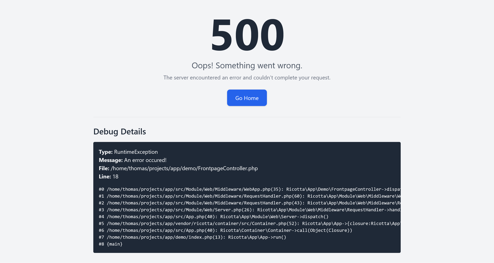

[](https://github.com/thomasnordahl-dk/app/actions/workflows/tests.yml)

# ricotta/app

**ricotta/app** is the core application of the Ricotta framework.

- [License](LICENCE.md)
- [Contributing Guidelines](CONTRIBUTING.md)
- [Code of Conduct](CODE_OF_CONDUCT.md)
- [Roadmap](ROADMAP.md)

## Table of Contents

- [Installation](#installation)
- [Usage](#usage)
  - [Basic Setup](#basic-setup)
  - [Routing](#routing)
  - [Controller Classes](#controller-classes)
  - [Dependency Injection](#dependency-injection)
  - [Modules](#modules)
  - [Configuration Interface](#configuration-interface)
  - [Advanced Routing](#advanced-routing)
  - [Middleware](#middleware)
  - [Templates](#templates)
  - [Result Models](#result-models)
  - [Error Handling](#error-handling)
  - [Console Commands](#console-commands)

## Installation

Install the framework via Composer:

```bash
composer require ricotta/app
``` 

## Usage

### Basic Setup

Create an `index.php` file in your webroot directory to bootstrap the application:

```php
<?php

require_once __DIR__ . '/vendor/autoload.php';

use Ricotta\App\App;

$app = new App();

$app->loadModules();

$app->run();
``` 

### Routing

Define routes by mapping URL paths to controller classes via the application's `routes` property. Each route supports HTTP method binding:

```php
<?php
// {root}/webroot/index.php

require_once __DIR__ . '/vendor/autoload.php';

use Ricotta\App\App;
use MyModule\GetFrontPage;
use MyModule\PostComment;

$app = new App();

$app->routes['/']->get(GetFrontPage::class);
$app->routes['/post-comment']->post(PostComment::class);

$app->run();
``` 

### Controller Classes

Controllers must implement the `Controller` interface. They automatically receive the PSR-7 request and any services or components registered with the Dependency Injection Container (DIC) via dependency injection. Controllers are autowired—no explicit registration with the DIC is needed.

```php
<?php
namespace MyModule;

use Psr\Http\Message\ResponseInterface;
use Psr\Http\Message\ResponseFactoryInterface;
use Psr\Http\Message\StreamFactoryInterface;
use Ricotta\App\Web\Controller;

class GetFrontPage implements Controller
{
    public function __construct(
        private readonly ResponseFactoryInterface $responseFactory,
        private readonly StreamFactoryInterface $streamFactory
    ) {}

    public function dispatch(): ResponseInterface
    {
        $stream = $this->streamFactory->createStream("Hello FrontPage");
        return $this->responseFactory->createResponse(200)
            ->withBody($stream);
    }
}
``` 

### Dependency Injection

Services and components can be bootstrapped and configured for dependency injection using the bootstrapping object on the `App` instance. These services are registered with the Dependency Injection Container (DIC). See the [ricotta/container documentation](https://github.com/thomasnordahl-dk/container) for further details.

```php
$app->bootstrap['MyService::class']->register();
``` 

### Modules

#### Module packages

Optional modules to a Ricotta project can be placed in separate Git repositories and defined as a Packagist package
with the type: `ricotta`.

When the method `Ricotta\App\App::loadModules()` is called (see Basic Setup), each of these packages are scanned for
bootstrapping files in the root folder of the package.

Bootstrapping can be placed in either `common.php`, `web.php`, or `cli.php`.

Each of these files, if present, should contain a PHP script, that bootstraps or configures components and services
on the `$app`variable (the `Ricotta\App\App` object) , which is present in the scope of the script. 

##### `common.php`

This file is always loaded, when present.

##### `web.php`

If present, this is loaded when the SAPI environment is not CLI - i.e. a web request context.

##### `cli.php`

If present, this is loaded when the SAPI environment is CLI - i.e. when a console command is run. See [Console Commands](#console-commands).

These files contain the modules' required bootstrapping for the three different contexts - common, web, and cli.

```php
# common.php

/** @var Ricotta\App\App $app */
$app->bootstrap[UserRepository::class]->register();

```


```php
# web.php

/** @var Ricotta\App\App $app */
$app->routes['/my-page']->get(MyPageController::class);

```

```php
# cli.php

use Ricotta\App\App;
use Ricotta\App\Module\Console;

/** @var Ricotta\App\App $app */
$app->bootstrap[MyCommand::class]->register();

$app->bootstrap[Console::class]
    ->configure(fn (Console $console) => $console->register(MyCommand::class));
```

#### Module classes

Encapsulate bootstrapping and routing logic in module classes. Each module must implement the `Module` interface:

```php
<?php

use Ricotta\App\App;
use Ricotta\App\Module;
use MyModule\GetFrontPage;

class MyModule implements Module
{
    public function register(App $app): void
    {
        $app->routes['/']->get(GetFrontPage::class);
        $app->bootstrap['MyService::class']->register();
    }
}
``` 

These can be used to group bootstrapping into neat classes instead of putting it all in the configuration files.

#### Optional Module Files

Besides the predefined PHP files for Ricotta module packages (`common.php`, `web.php`, and `cli.php`), custom
PHP files can be loaded with the `Ricotta\App\App::load()` method.

```php
<?php
// {root}/bootstrap.php

/** @var \Ricotta\App\App $app */
$app->add(new MyModule());
``` 

Then load this file with the app object. This could be in a module class, the package configuration files or the `index.php` file.

```php
<?php
/** @var Ricotta\App\App $app */
$app->load(dirname(__DIR__) . '/bootstrap.php');
``` 

### Configuration Interface

The application uses a configuration system based on the `Ricotta\App\Module\Configuration\Configuration` interface, which provides typed access to configuration values loaded at runtime.

In the default setup, configuration is loaded from a JSON file using the `JSONConfiguration` class. The configuration service is registered in the bootstrap process like this:

```php
use Ricotta\App\Module\Configuration\Configuration;
use Ricotta\App\Module\Configuration\JsonConfiguration;

/**
 * @var \Ricotta\App\App $app
 */
$app->bootstrap[Configuration::class]
    ->register()
    ->callback(fn () => new JsonConfiguration(__DIR__ . '/config.json'));
```

Once registered, the `Configuration` service can be injected wherever needed. Values are accessed using dot-separated paths to navigate nested structures. For example, given the following `config.json`:

```json
{
    "ricotta": {
        "test": {
            "string": "hello",
            "int": 2,
            "float": 2.2,
            "bool1": false,
            "bool2": true,
            "array": [
                "test",
                3,
                3.3,
                {
                    "indexed": "value"
                }
            ]
        }
    }
}
```

You can retrieve values like this:

```php
$configuration = $container->get(Configuration::class);

echo $configuration->string('ricotta.test.string'); // "hello"
echo $configuration->int('ricotta.test.int');       // 2
echo $configuration->float('ricotta.test.float');   // 2.2
echo $configuration->bool('ricotta.test.bool2');    // true

print_r($configuration->array('ricotta.test.array'));
```

If a value is missing, or the type does not match the expected type, a `ConfigurationException` will be thrown.  
The configuration file is loaded lazily — it is read and parsed only when a value is first accessed.

---

### Advanced Routing

Define routes with named placeholders and wildcards. Placeholder values are available via the `RouteResult` object.

```php
$app->routes['/show-product/{id}/*']->get(\MyModule\ShowProduct::class);
``` 

Example controller using advanced routing:

```php
<?php
namespace MyModule\V1;

use Psr\Http\Message\ResponseInterface;
use Psr\Http\Message\ResponseFactoryInterface;
use Psr\Http\Message\StreamFactoryInterface;
use Ricotta\App\Web\Controller;
use Ricotta\App\Web\Routing\RouteResult;

class ShowProduct implements Controller
{
    public function __construct(
        private readonly ProductRepository $productRepository,
        private readonly ResponseFactoryInterface $responseFactory,
        private readonly StreamFactoryInterface $streamFactory,
        private readonly RouteResult $routeResult
    ) {}

    public function dispatch(): ResponseInterface
    {
        $id = $this->routeResult->route?->parameters['id'];
        $wildcard = $this->routeResult->route?->wildcard;
        
        // Product lookup and response generation logic goes here.
    }
}
``` 

### Middleware

Requests and responses are processed through a stack of PSR-15 middleware. Define middleware as instances or container references, and configure the middleware stack using the component referenced by the `App::MIDDLEWARE_STACK` constant:

```php
<?php
use Ricotta\App\App;
use MyModule\CookieMiddleware;
use MyModule\SessionMiddleware;

$app->bootstrap[App::MIDDLEWARE_STACK]
    ->register()
    ->value([
        new CookieMiddleware(),
        $app->bootstrap[SessionMiddleware::class]->reference(),
    ]);
``` 

### Templates

Ricotta provides a modular, PHP-based template engine.

#### Registering a Package Path

Define a template folder for a package (ideally using a Composer package name):

```php
<?php
use Ricotta\App\Template\TemplateEngine;

$app->bootstrap[TemplateEngine::class]->configure(
    function (TemplateEngine $templates) {
        $templates->addPackagePath('vendor/name', '/path/to/vendor/name/templates');
    }
);
``` 

#### Creating a Template

Templates can be plain HTML or PHP script files:

```html
<!-- path/to/vendor/name/templates/frontpage.html -->
<html>
  <body>
    <h1>Hello world</h1>
  </body>
</html>
``` 

#### Rendering a Template

Render templates within your controller:

```php
<?php
namespace MyModule;

use Ricotta\App\Web\Controller;
use Psr\Http\Message\ResponseInterface;
use Psr\Http\Message\ResponseFactoryInterface;
use Ricotta\App\Template\TemplateEngine;

class ShowFrontPage implements Controller
{
    public function __construct(
        private readonly ResponseFactoryInterface $responseFactory,
        private readonly TemplateEngine $templateEngine
    ) {}

    public function dispatch(): ResponseInterface
    {
        $content = $this->templateEngine->render('frontpage', 'ricotta/app');
        $response = $this->responseFactory->createResponse(200);
        $response->getBody()->write($content);
        return $response;
    }
}
``` 

#### Overriding Templates

Multiple paths can be registered for the same package. The template engine scans the paths in reverse order of registration, using the first matching file:

```php
$app->bootstrap[TemplateEngine::class]->configure(
    function (TemplateEngine $templates) {
        $templates->addPackagePath('vendor/name', '/path/to/vendor/name/templates');
    }
);

$app->bootstrap[TemplateEngine::class]->configure(
    function (TemplateEngine $templates) {
        $templates->addPackagePath('vendor/name', '/path/to/vendor/extension/templates');
    }
);
``` 

#### Injecting Variables

Pass variables to your templates via the third parameter of the `render()` method:

```php
<?php
public function dispatch(): ResponseInterface
{
    $view = new View();
    $view->message = 'Hello World';

    $content = $this->templateEngine->render('frontpage', 'ricotta/app', ['view' => $view]);

    $response = $this->responseFactory->createResponse(200);
    $response->getBody()->write($content);
    return $response;
}
``` 

In your template (e.g., `frontpage.php`):

```php
<?php
/** @var View $view */
?>
<html>
  <body>
    <h1><?= $view->message ?></h1>
  </body>
</html>
``` 

#### Callback Templates

Define templates as callbacks. Callback parameters are automatically injected, making nested template rendering straightforward:

```php
<?php
// path/to/vendor/extension/templates/frontpage.php
return function (View $view, TemplateEngine $templateEngine) {
?>
<html>
  <body>
    <h1><?= $view->message ?></h1>
    <content>
      <?= $templateEngine->render('content', 'vendor/name') ?>
    </content>
  </body>
</html>
<?php
};
``` 

### Result Models

Controllers can return either a PSR-7 response or an instance of the `Result` interface, streamlining common response flows.

The interface includes:

```php
public function createResponse(\Ricotta\Container\Container $container): \Psr\Http\Message\ResponseInterface;
``` 

Ricotta provides several result models:

#### HTMLResult

Render responses based on templates:

```php
<?php
namespace MyModule;

use Ricotta\App\Web\Controller;
use Ricotta\App\Web\Result\HTMLResult;

class ShowFrontPage implements Controller
{
    public function dispatch(): HTMLResult
    {
        $view = new View();
        $view->message = 'Hello World';
        return new HTMLResult('frontpage', 'ricotta/app', ['view' => $view]);
    }
}
``` 

#### JSONResult

Generate JSON responses from data:

```php
<?php
namespace MyModule;

use Ricotta\App\Web\Controller;
use Ricotta\App\Web\Result\JSONResult;

class GetData implements Controller
{
    public function dispatch(): JSONResult
    {
        return new JSONResult(['data' => 'is encoded as json']);
    }
}
``` 

#### NotFoundResult

Return a friendly 404 page using the default not-found template:

```php
<?php
namespace MyModule;

use Ricotta\App\Web\Controller;
use Ricotta\App\Web\Result\HTMLResult;
use Ricotta\App\Web\Result\NotFoundResult;
use Ricotta\App\Web\Routing\RouteResult;

class GetProduct implements Controller
{
    public function __construct(
        private ProductRepository $repository,
        private RouteResult $routeResult
    ) {}

    public function dispatch(): mixed
    {
        $id = $this->routeResult->route?->parameters['id'] ?? '';
        $product = $this->repository->get($id);

        if ($product === null) {
            return new NotFoundResult();
        }

        return new HTMLResult('product-page', 'vendor/name', ['product' => $product]);
    }
}
``` 

### Error Handling

By default, ricotta/app displays a user-friendly error page that suppresses internal errors. To override this behavior, implement the `ErrorHandler` interface. Your custom error handler should log errors and return an appropriate PSR-7 response.

```php
<?php
use Psr\Http\Message\ResponseInterface;
use Psr\Http\Message\ResponseFactoryInterface;
use Psr\Log\LoggerInterface;
use Ricotta\App\Web\Error\ErrorHandler;

class LogErrorHandler implements ErrorHandler
{
    public function __construct(
        private readonly ResponseFactoryInterface $responseFactory,
        private readonly LoggerInterface $logger
    ) {}

    public function handle(\Throwable $error): ResponseInterface
    {
        $this->logger->error($error->getMessage());

        $response = $this->responseFactory->createResponse(500);
        $response->getBody()->write('Internal Server Error');

        return $response;
    }
}
``` 

Register your custom error handler as the implementation for the `ErrorHandler` interface:

```php
<?php
use Ricotta\App\App;
use Ricotta\App\Web\Error\ErrorHandler;

$app->bootstrap[ErrorHandler::class]
    ->register()
    ->type(LogErrorHandler::class);
``` 

#### Debug Error Handler

Register the `Ricotta\App\Web\Error\DebugErrorHandler` class as the error handler to render errors on error pages in development environments.


```php
<?php
use Ricotta\App\App;
use Ricotta\App\Web\Error\ErrorHandler;
use Ricotta\App\Web\Error\DebugErrorHandler;

$app->bootstrap[ErrorHandler::class]
    ->register()
    ->type(DebugErrorHandler::class);
``` 



### Console Commands

The Ricotta framework comes with a simple CLI command runner. It is distributed as a binary file:

    ~ vendor/bin/ricotta

    The following arguments are required: [-c command name].
    Usage: bin/ricotta [-c command name]

    Required Arguments:
            -c command name
                    The name of the command to run
    Available commands:
    ****************************************
    my-module:my-command     Run the my-command from the my-module module.
    ****************************************

Commands are invoked with `-c` argument

    ~ vendor/bin/ricotta -c my-module:my-command

#### Custom commands

A new command is created by implementing the `Ricotta\App\Module\Console\Command` interface:

```php

namespace Ricotta\MyModule; 

use Ricotta\App\Module\Console\Command;

class MyCommand implements Command
{
    public static function getName(): string
    {
        return "my-module:my-command";
    }

    public static function getDescription(): string
    {
        return "Run the my-command from the my-module module.";
    }

    public function run(): void
    {
        // Perform the actions of the command
    }
}
```

The command should then be registered with the container and the console class in the app bootstrapping. A good
place for this could be the `cli.php` configuration file in the Ricotta package repository.

```php
$app->bootstrap[MyCommand::class]->register();

$app->bootstrap[Console::class]
    ->configure(fn (Console $console) => $console->register(MyCommand::class));
```

The method of reading command arguments and producing output is up to the implementation, but for convenience,
the library [`league/climate`](https://climate.thephpleague.com) can be used to accomplish this.

You can use it directly or you can leverage the `Ricotta\App\Module\Console\ClimateFactory` component to create
new instances of `League\CLIMate\CLIMate` instead of constructing the objects directly.

```php

namespace Ricotta\MyModule; 

use Ricotta\App\Module\Console\Command;

class MyCommand implements Command
{
    public function __construct(private ClimateFactory $climateFactory) { }

    public static function getName(): string
    {
        return "my-module:my-command";
    }

    public static function getDescription(): string
    {
        return "Run the my-command from the my-module module.";
    }

    public function run(): void
    {
        $climate = $this->climateFactory->create();

        $name = $climate->input->prompt("What is your name?");

        $climate->output->line("Hello {$name}");
    }
}
```

    ~ vendor/bin/ricotta -c my-module:my-command
    ~ What is your name?
    ~ Hello John
